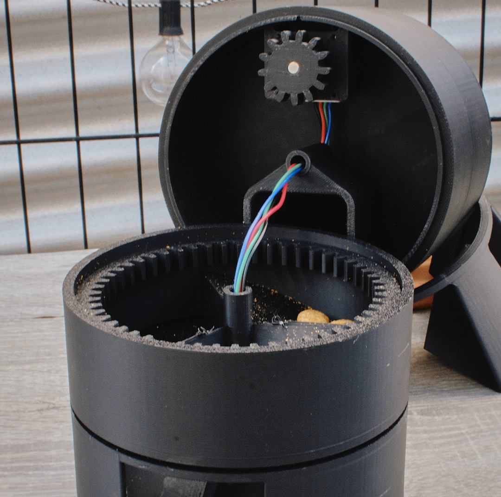
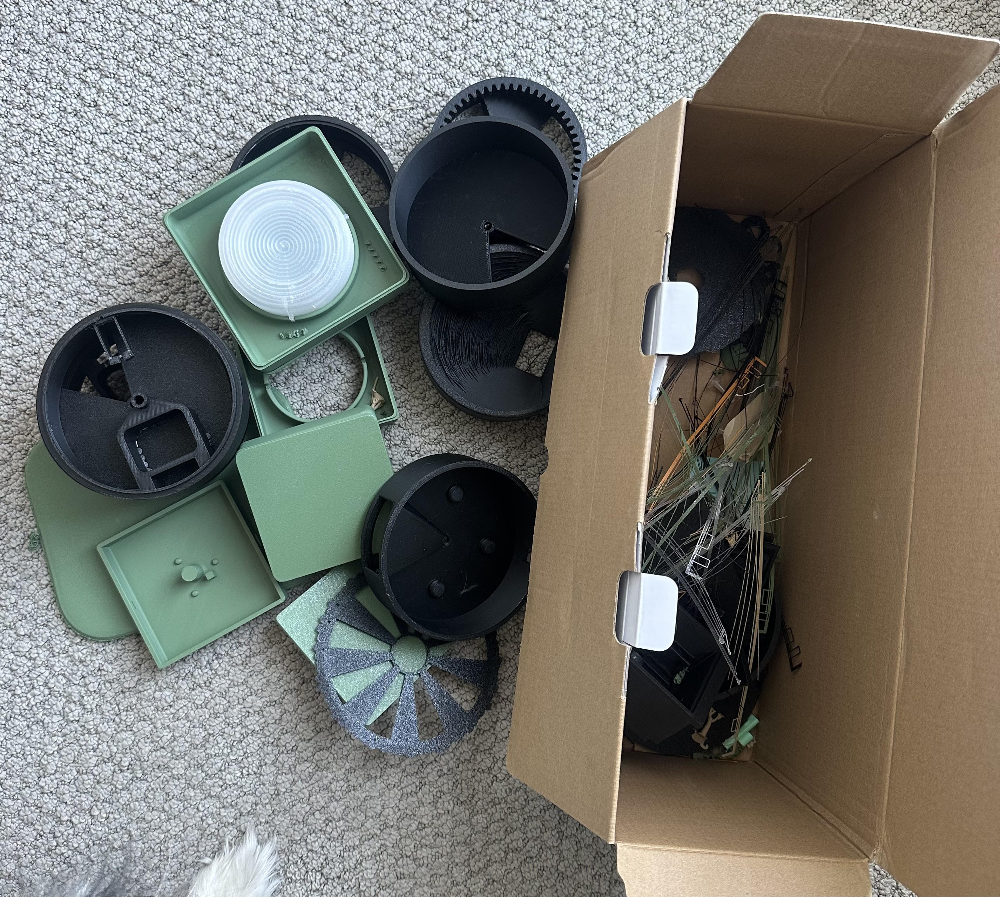
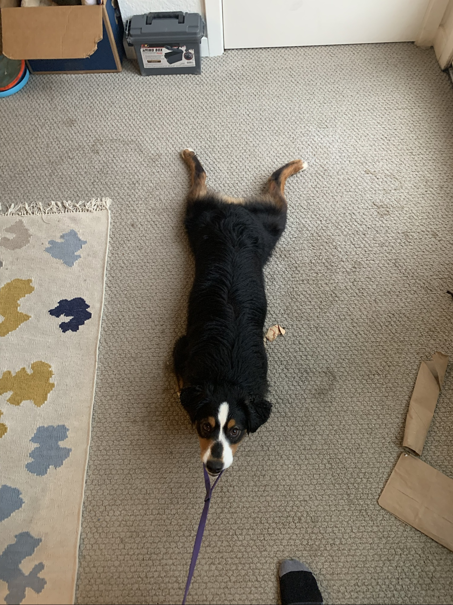

# IDC 2 - A Pretty Smart Dog Puzzle Toy

> **Note:** Unfortunately im quite sick, I'll improve this once im better/now that i have timeto put it on my portfolio site

## Design Evolution

### Original Prototype

<video controls src="assets/idc1.mp4" title="IDC1 in action"></video>

### Final Design

## How It Works

Research indicates that dogs continue to try independently to solve puzzles as long as they are successful at least 60% of the time. This toy is designed with a **variable difficulty level** that automatically adjusts based on the dog's performance. This keeps the dog engaged and motivated to continue playing.

The difficulty is scaled by adjusting the puzzle "level," which controls:
- The number of steps required to access the food
- The complexity of the steps
- The number of mistakes allowed before the puzzle is reset

## Features

- **Variable difficulty level** that adjusts based on the dog's performance
- **Food dispenser** that rewards successful puzzle completion
- **3 buttons** with full RGB backlighting
- **Motion sensor** that works with the "puzzle interval timer" to detect when the dog is awake and ready to play
- **Web interface** for monitoring performance and adjusting settings *(Future: adding a small screen to eliminate the need for phone/computer interaction)*
- **Buzzer** for audio feedback
- **Easy-to-clean design** gave a lot of thought to it for IDC 1 and implemented a similar design for IDC 2
- **Super sexy design** that just looks so good (in my humble opinion)

## Technical Details

- **Helical gears** for smooth and quiet operation
- **Ball bearing** at the center of the gear system to reduce noise and friction

TODO: Will add a video of the toy in action!! But rn I need to sleep

Look at that. You've wasted another perfectly good 5 minutes reading about this project. 

<video controls src="assets/IMG_5791.MOV" title="dog licking me"></video>

