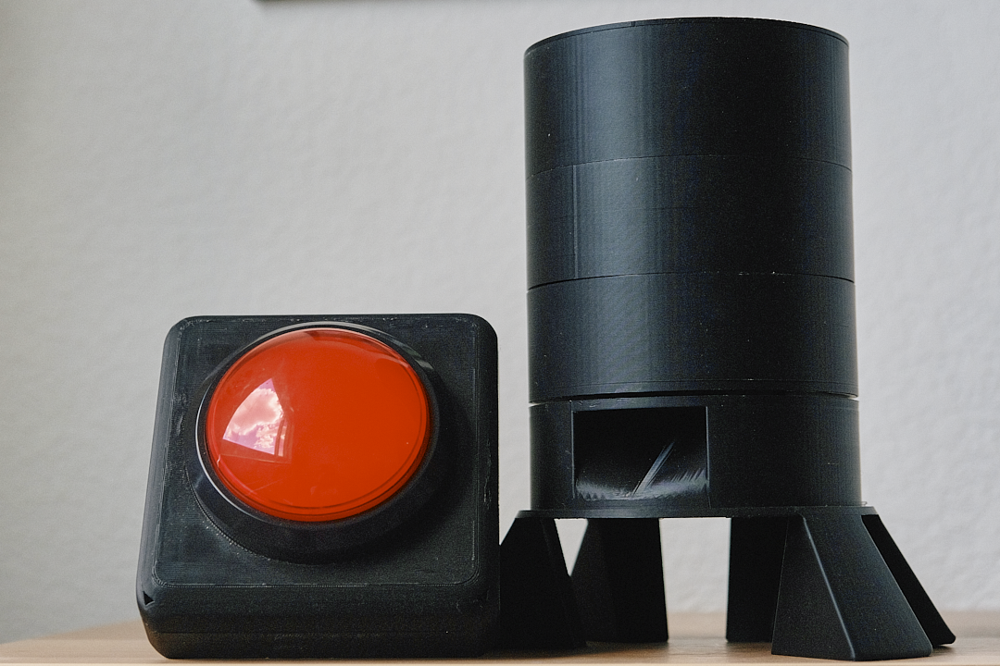
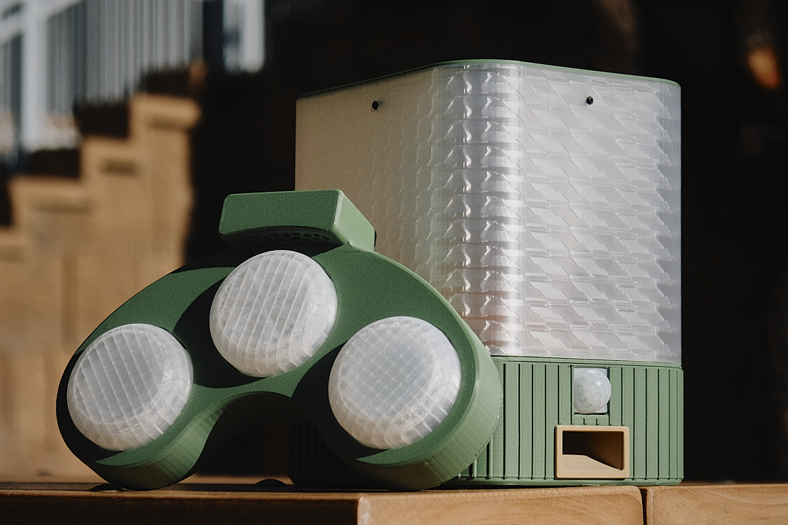
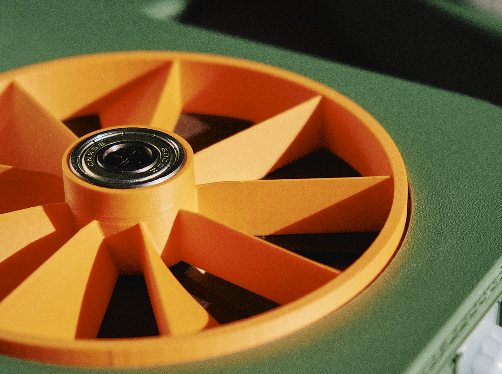
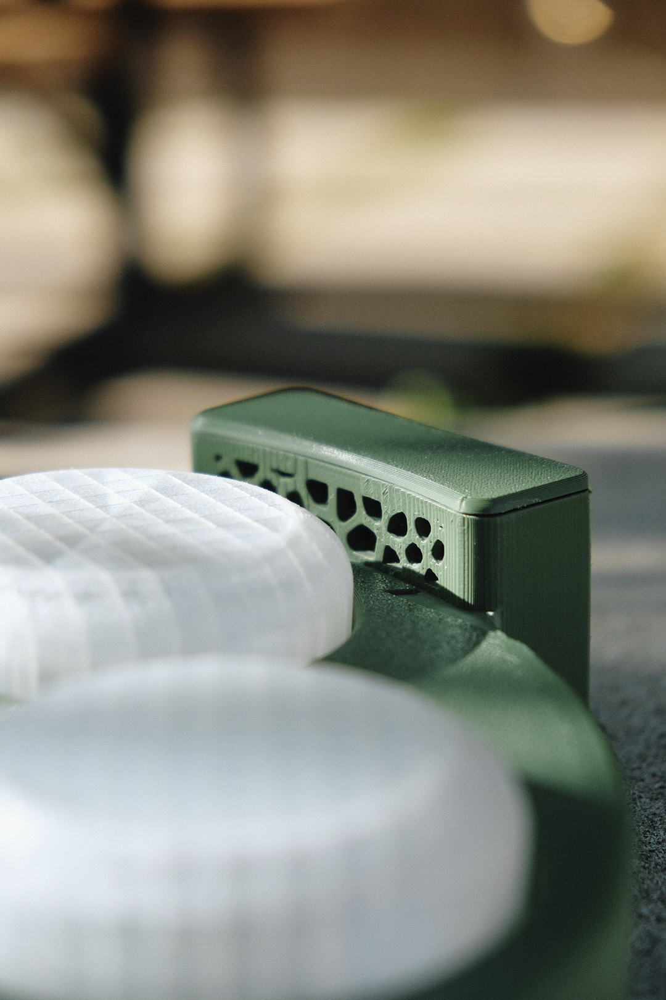
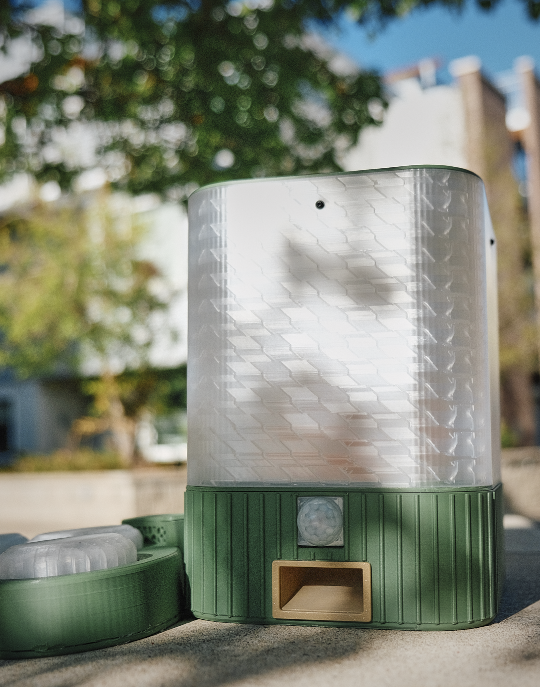

# IDC 2 - A Pretty Smart Dog Puzzle Toy

The original prototype design:

Now for the sexy one:

TODO: Explain how this project has brains (not just beauty)

Something like:

Research indicates that dogs with continue to try independently to solve puzzles as long as they are successful at least 60% of the time. This toy is designed to have a variable difficulty level, which automatically adjust based on the dog's performance. This keeps the dog engaged and motivated to continue playing. The level of difficulty is scaled by adjusting "level" of the puzzle. This includes the number of steps required to access the food, the complexity of the steps, and even the number of mistakes allowed before the puzzle is considered failed.

